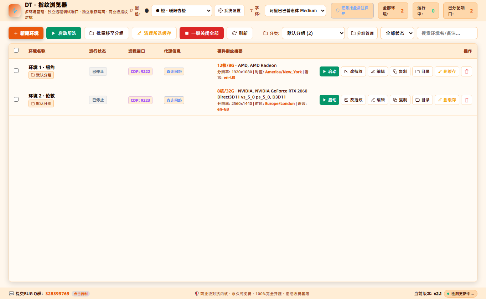
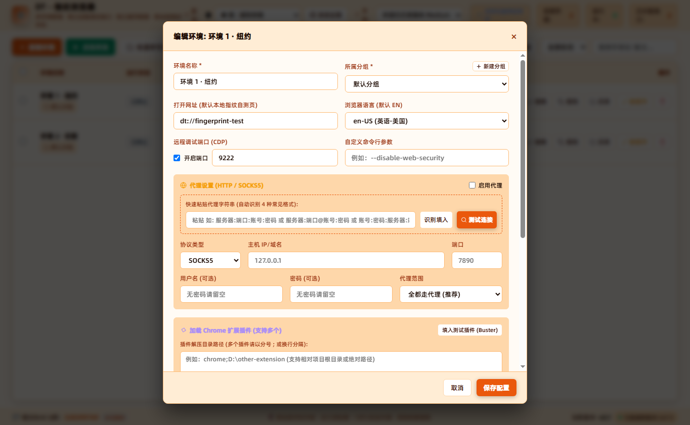
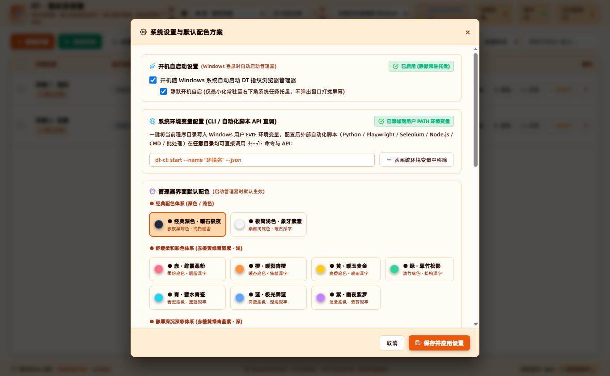
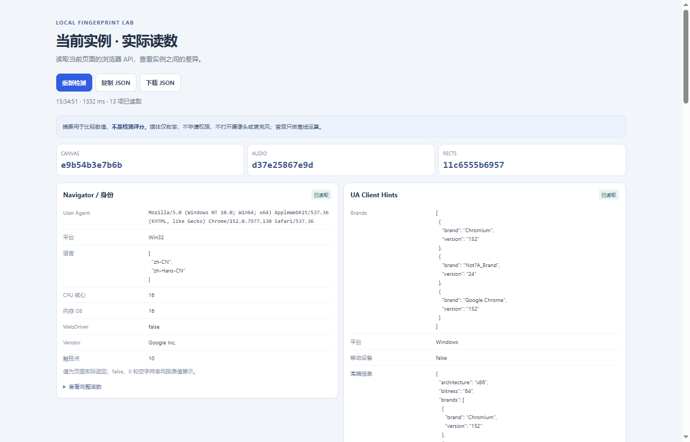

# DT - 指纹浏览器 (DT Fingerprint Browser)

> 🌟 **【永久纯免费 · 100% 完全开源 · 拒绝商业割韭菜】**
>
> 🚀 **本软件为商业级指纹浏览器桌面管理系统，底层对抗能力与交互体验全面对标主流商业收费级指纹浏览器，但是坚持 100% 完全开源、完全免费、永久免费、无任何套路、不限窗口数量、不限环境多开！**
> 
> 💡 **项目初心与开源承诺**：作者做这个项目的初衷，就是看不惯市面上动辄几十上百元/月、限制窗口数、限制多开的商业收费指纹浏览器套路。本项目代码**完全开源、透明安全、绝无任何后门与隐私收集**，无论你是独立开发者、出海跨境电商、自动化爬虫采集、网络安全渗透还是矩阵运营工程师，都可以**零门槛、零成本、永久自由使用与二次开发**！
>
> 💬 **官方技术交流 & BUG 提交反馈 QQ 群**：`328399769`  
> 欢迎进群交流指纹对抗技术、提交 BUG 与功能建议、获取最新编译发布的便携包与安装包！
>
> 📥 **Release 官方最新版本下载（纯英文标准命名，含版本号）**：
> - 📦 **独立安装向导包**：[`DT-Fingerprint-Browser-v2.1-Setup.exe`](https://github.com/wei3470231/DT-Fingerprint-Browser/releases/latest)（自动配置用户 PATH 环境变量与开机自启）
> - 🗜️ **绿色便携压缩包**：[`DT-Fingerprint-Browser-v2.1-Portable.zip`](https://github.com/wei3470231/DT-Fingerprint-Browser/releases/latest)（解压即用，无任何绝对路径依赖）
> - 🌐 **GitHub Releases 发布页面**：[https://github.com/wei3470231/DT-Fingerprint-Browser/releases](https://github.com/wei3470231/DT-Fingerprint-Browser/releases)

---

## 📸 软件界面实测与功能展示

| 桌面环境管理器 (原生免安装便携版) | 高级环境配置与代理自动识别 |
| :---: | :---: |
|  |  |

| 全局系统设置与主题定制 | 内置本地指纹自测实验室 |
| :---: | :---: |
|  |  |

---

## 目录
0. [界面预览与纯免费宣言](#-软件界面实测与功能展示)
1. [系统要求与跨设备便携移植指南](#1-系统要求与跨设备便携移植指南)
2. [便携包极速测试与构建指南](#2-便携包极速测试与构建指南)
3. [最新版本功能与增强内容汇总 (Changelog)](#3-最新版本功能与增强内容汇总-changelog)
4. [命令行 CLI 原生调用详解 (DT-CLI)](#4-命令行-cli-原生调用详解-dt-cli)
   - 4.1 [运行机制与环境自适应](#41-运行机制与环境自适应)
   - 4.2 [模式一：Chrome 原生无感替代模式 (Drop-in Chrome Mode)](#42-模式一chrome-原生无感替代模式-drop-in-chrome-mode)
   - 4.3 [模式二：商业化环境管理模式 —— 完整指令速查总表](#43-模式二商业化环境管理模式--完整指令速查总表)
   - 4.4 [环境生命周期与运行控制指令 (`start`, `stop`, `status`, `cdp-url`)](#44-环境生命周期与运行控制指令)
   - 4.5 [环境配置与 CRUD 完整指令 (`list`, `get`, `create`, `update`, `clone`, `delete`, `clear-cache`)](#45-环境配置与-crud-完整指令)
   - 4.6 [指纹与代理专项控制 (`random-fp`, `batch-random-fp`, `set-proxy`, `test-proxy`, `set-ext`)](#46-指纹与代理专项控制)
   - 4.7 [业务分组管理与批量操作 (`group`, `set-group`, `batch-set-group`, `batch-delete`)](#47-业务分组管理与批量操作)
   - 4.8 [书签/横向收藏夹栏管理 (`bookmark`)](#48-书签横向收藏夹栏管理-bookmark)
   - 4.9 [字体与主题外观管理 (`font`, `theme`)](#49-字体与主题外观管理-font--theme)
   - 4.10 [系统全局设置与实用工具 (`settings`, `env`, `autostart`, `gui`, `compile`)](#410-系统全局设置与实用工具)
   - 4.11 [全局环境变量与任意路径直调机制 (PATH Direct Invocation)](#411-全局环境变量与任意路径直调机制-path-direct-invocation)
   - 4.12 [自动化脚本调用与集成示例 (PowerShell / Batch)](#412-自动化脚本调用与集成示例-powershell--batch)
5. [Node.js 核心代码 API 调用](#5-nodejs-核心代码-api-调用)
6. [Python / 自动化脚本接入示例 (Playwright / Selenium / Puppeteer)](#6-python--自动化脚本接入示例-playwright--selenium--puppeteer)
   - 6.1 [方式一：Playwright 极简直连模式 (利用 `cdp-url --ws`)](#61-方式一playwright-极简直连模式-利用-cdp-url---ws)
   - 6.2 [方式二：Python 企业级自动化调度全链路](#62-方式二python-企业级自动化调度全链路)
   - 6.3 [方式三：Playwright 原生 Chrome 替代模式 (Drop-in Chrome Mode)](#63-方式三playwright-原生-chrome-替代模式-drop-in-chrome-mode)
   - 6.4 [方式四：Python + Selenium CDP 直连与代理验证](#64-方式四python--selenium-cdp-直连与代理验证)
   - 6.5 [方式五：Node.js / Puppeteer 原生脚本与 CLI 调用](#65-方式五nodejs--puppeteer-原生脚本与-cli-调用)
7. [CDP 协议原生 HTTP 接口规范](#7-cdp-协议原生-http-接口规范)
8. [代理格式与高级规则指南](#8-代理格式与高级规则指南)
9. [Chrome 扩展插件配置与设置指南](#9-chrome-扩展插件配置与设置指南)
10. [精简版系统 (Windows Lite/Ghost) 兼容与统一字体管理指南](#10-精简版系统-windows-liteghost-兼容与统一字体管理指南)
11. [开机自动启动与静默托盘机制说明](#11-开机自动启动与静默托盘机制说明)
12. [原生 EXE 启动器源码与编译架构](#12-原生-exe-启动器源码与编译架构)
13. [商业级标准安装包与对外分发构建指南 (Distribution & Packaging)](#13-商业级标准安装包与对外分发构建指南-distribution--packaging)
14. [开源协议与安全声明 (Open Source & License)](#14-开源协议与安全声明-open-source--license)

---

## 1. 系统要求与跨设备便携移植指南

### 1.1 目标设备环境要求
本项目已经过**全链路便携化加固**，没有任何硬编码绝对路径。当您把软件目录复制到其他任意 Windows 计算机、更换盘符（如从 E 盘复制到 C 盘或 D 盘、U盘）运行时，无需修改任何代码配置，开箱即用：

| 组件 / 运行环境 | 要求说明 | 必备程度 |
| :--- | :--- | :--- |
| **操作系统** | Windows 10 / 11 / Windows Server 2016+ (64 位) | 必须 |
| **定制 Electron 内核** | `runtime/` 文件夹（已内置定制 Chromium 浏览器内核及依赖库） | 必须（随文件夹自带，无需额外下载） |
| **.NET Framework** | .NET Framework 4.5+（Win 10/11 系统自带，用于原生运行 `DT-Fingerprint-Browser.exe` 和 `DT-CLI.exe`） | 必须（系统自带） |
| **Node.js** | 推荐安装 **Node.js v18+ 或 v20+ LTS**。<br>*注：即使目标设备完全没有安装 Node.js，`DT-CLI.exe` 与管理器也会自动 fallback 到内置定制 Chromium 内核以 `ELECTRON_RUN_AS_NODE=1` 运行，100% 独立可用！* | 推荐（开发时需要，便携运行非必须） |
| **Visual C++ 运行库** | Microsoft Visual C++ 2015–2022 Redistributable (x64) | 推荐（若纯净系统提示缺失 VC 运行时安装） |

### 1.2 便携包结构规范 (dist/payload)
为了保障源码清洁与商业分发安全，项目根目录保持纯源码形态，所有独立可执行文件集中生成并运行于便携包目录中：

```text
dist/payload/ (独立免安装便携版)
├── DT-Fingerprint-Browser.exe # 桌面端 GUI 管理器主程序（双击运行，纯英文文件名，内置原生图标）
├── DT - 指纹浏览器.exe        # 中文兼容副本（双击直接拉起桌面端管理器）
├── DT-CLI.exe                 # 原生命令行控制工具（支持外部脚本无缝调用）
├── dt-cli.cmd                 # 便捷命令行包装入口
├── dt.cmd                     # 极简别名包装入口
├── app.ico                    # 应用程序原生高清图标
├── runtime/                   # 定制 Chromium/Electron 内核 (含 resources/app.asar 脱敏资产)
├── Fonts/                     # 离线中文字体库 (精简版系统兜底支持)
└── data/                      # 用户独立环境与配置数据 (environments.json, profiles/)
```

* **环境与 Cookie 迁移**：
  * `data/environments.json`：保存所有环境配置，配置中的 `userDataDir` 均已采用相对路径（如 `data\profiles\env-xxxx`）。
  * `data/profiles/`：每个环境各自独立的用户缓存目录，保存了所有的 Cookies、LocalStorage、IndexedDB 和登录状态。拷贝该目录即可无缝迁移所有登录会话！

---

## 2. 便携包极速测试与构建指南

本项目推行**标准便携包测试流程**，根目录不存放可执行二进制文件，所有测试均以 `dist/payload` 便携环境进行验证。

### 2.1 一键运行便携包自动化测试套件
在项目根目录下执行：
```powershell
node scripts/test-portable.js
```
该测试脚本会自动对便携包进行 19 项全链路验收测试：
* 验证便携包核心可执行文件（`DT-Fingerprint-Browser.exe`、`DT - 指纹浏览器.exe`、`DT-CLI.exe`）；
* 验证核心脱敏资产包 `runtime/resources/app.asar` 与定制 Chromium 内核；
* 验证精简系统兜底字体库 `Fonts/`；
* 验证 CLI Chrome Drop-in 模式（`--version`、`--product-version`）；
* 验证 CLI JSON 管理指令（`list`、`font status`、`theme status`、`settings get`）；
* 验证发布用便携压缩包 `dist/DT-Fingerprint-Browser-v2.1-Portable.zip`。

### 2.2 一键生成便携包与商业安装程序
在项目根目录下执行：
```powershell
node scripts/build-installer.js
```
构建脚本将全自动完成：
1. **源码脱敏加密**：使用 Terser 进行变量混淆并打包进虚拟归档 `app.asar`；
2. **生成便携目录**：在 `dist/payload/` 编译生成原生无黑框启动器与 CLI 工具；
3. **打包免安装包**：生成 Release 发布用便携压缩包 `dist/DT-Fingerprint-Browser-v2.1-Portable.zip`（约 200 MB，无中文字符，解压即用）；
4. **编译安装程序**：生成 Release 发布用独立单文件安装向导 `dist/DT-Fingerprint-Browser-v2.1-Setup.exe`（自动配置用户 PATH 与开机自启）。

### 2.3 根目录快捷调用机制
在根目录下提供了 `dt-cli.cmd` 与 `dt.cmd` 包装脚本：
* 若 `dist/payload/DT-CLI.exe` 存在，优先以编译后的原生便携程序执行；
* 若未生成便携包，自动回退到 `node cli.js`，保证在开发调试阶段无感切换。

---

## 3. 最新版本功能与增强内容汇总 (Changelog)

在近期版本中，我们对商业化操作体验与底层架构进行了深度优化与加固：

### 3.1 彻底移除顶部系统默认菜单栏
在管理器主进程（`src/gui/main.js`）以及浏览器外层宿主主进程（`src/browser/main.js`）中，全面执行：
```javascript
Menu.setApplicationMenu(null);
if (typeof mainWindow.setMenu === 'function') mainWindow.setMenu(null);
if (typeof mainWindow.setMenuBarVisibility === 'function') mainWindow.setMenuBarVisibility(false);
```
彻底去除了原生 Electron 默认的多余系统菜单栏，界面更加现代、沉浸、专业。

### 3.2 全局右键上下文菜单支持 (ContextMenu)
无论是指纹浏览器内的网页视图、顶部标签栏/地址栏控制器，还是管理器主界面，均已全面挂载上下文右键菜单：
* **选中文本时**：弹出快捷复制（Copy）、剪切（Cut）菜单；
* **可输入输入框内**：支持剪切、复制、粘贴（Paste）、全选（Select All）；
* **空白区域**：提供“重新加载页面 (Reload)”与“检查元素 (Inspect Element / DevTools)”选项。

### 3.3 自定义启动命令行多参数高级分词支持
重构了基于有限状态机的 `tokenizeCommandLineArgs` 分词解析器：
* 支持多个开关同时传入，如 `--disable-gpu --blink-settings=imagesEnabled=false --remote-allow-origins=*`；
* 支持带空格的引号字符串，如 `--window-name="My Custom Window"`；
* 支持单横杠、双横杠和无值参数，彻底解决了多参数被整体当成单个参数传入导致的解析失效问题。

### 3.4 智能远程调试端口分配与系统级防冲突探活
在 `src/manager/store.js` 中新增了 `isPortAvailable(port)` 与 `getNextAvailablePort()`：
* 不仅比对 `environments.json` 中已配置过的环境端口；
* 更通过 `net.createServer()` 实时向操作系统底层申请绑定监听，检测该端口是否被系统外部其他软件（如 IIS、Nginx、本地服务）占用；
* UI 在保存配置前也会进行实时占用校验，确保为每个指纹环境分配的远程调试端口绝对可用、独立不冲突。

### 3.5 管理器双重单例互斥锁 (防多开机制)
* **Win32 原生层面**：`DT-Fingerprint-Browser.exe` 与 `DT - 指纹浏览器.exe` 采用 `FindWindow` + `SetForegroundWindow`，多开时瞬间将已运行的窗口激活置顶，多余进程直接退出；
* **Electron 底层**：`src/gui/main.js` 采用 `app.requestSingleInstanceLock()` 互斥锁，多开实例毫秒级安全退出，避免多开操作造成配置并发覆盖或端口冲突。

### 3.6 全项目零绝对路径加固
* 移除所有代码中写死的磁盘盘符（`E:\...`）；
* `store.js` 增加自动规范化修复（`normalizeRecord`），读取配置时自动将任何绝对路径转化为基于项目根目录的相对路径；
* 浏览器启动时统一通过 `path.resolve(ROOT_DIR, relativePath)` 动态锚定项目物理位置，保证软件目录移动到任何设备、任何盘符均可开箱即用。

### 3.7 Windows 开机自动启动与静默常驻托盘 (Auto-Start)
* **双重系统级自启绑定**：结合 Electron 原生 `app.setLoginItemSettings` 与 Windows 注册表 `HKCU\Software\Microsoft\Windows\CurrentVersion\Run`，实现便携版与安装版 100% 稳定自启；
* **静默托盘模式**：支持开启“静默开机自启”，开机登录时管理器在后台自动启动并常驻右下角系统任务托盘（`--minimized`），不弹出主窗口打扰屏幕，随时待命响应外部自动化与 CLI 调度。

### 3.8 一键添加用户 PATH 环境变量与全局 API 访问
* **管理器 UI 一键配置**：在“⚙️ 系统设置”弹窗中提供一键写入/移除系统环境变量按钮，实时检测当前软件目录是否已挂载到用户 `PATH`；
* **系统级 CMD/注册表纯净支持（精简版系统免 PowerShell 兼容）**：采用 Windows 原生 CMD 与 `reg.exe` 核心规范直接读写 `HKCU\Environment`，支持超长 PATH 且绝无 1024 字符截断隐患；并自动触发 Windows 全局 `WM_SETTINGCHANGE` 广播；
* **全平台全局直调**：配置后，无论在系统任意目录、任意终端（CMD、PowerShell、Git Bash）或自动化脚本中，直接输入 `dt-cli` 即可发起 API 请求。

### 3.9 经典双色 + 七彩纯正底色体系（16 款主题）
* **新增经典双色**：正式加入 **“🌙 经典深色 · 曜石极夜”**（极夜深黑底色配高亮白字）与 **“☀️ 极简浅色 · 象牙素雅”**（素雅浅白底色配高对比黑字）；
* **彻底解决底色切换失效问题**：重构了 CSS 层叠优先级，将 `:root` 兜底变量置顶，所有主题统一使用 `html[data-theme="..."]` 高优先级选择器；
* **全组件底色强联动**：切换任何配色方案时，主窗口背景、核心表格大卡片、顶部导航栏、表头、输入框及浏览器标签栏均会同频变换至对应底色。

### 3.10 商业化独立环境分组体系与多维分类管理
* **独立分组注册持久化**：在 `data/settings.json` 中建立独立的 `groups` 注册表，自动保障内置 `"默认分组"` 首位常驻且不可被误删；
* **独立分组管理弹窗**：管理器顶部提供“📁 分组管理”按钮，直观查看所有已建分组及其环境数量，支持添加、重命名与删除分组；
* **数据防丢迁移机制**：删除某个非默认分组时，系统会自动将该分组下的全部环境配置平滑无损迁移至“默认分组”，绝不丢失任何数据；
* **新建与修改配置的分组联动**：支持在弹窗中下拉选择分组或一键新建分组；主界面顶部支持按分类快速筛选。

### 3.11 离线与在线统一字体库支持与精简系统字体缺失修复
* 引入 `Fonts/` 字体存储目录，软件启动时自动扫描该目录下的所有 `.ttf` / `.otf` / `.woff` / `.woff2` 本地字体；
* 提供全局统一的字体加载与切换引擎（`DT-Custom-Font`），桌面端 GUI 管理器与多标签指纹浏览器实现 100% 统一渲染；
* 随包内置开源优质字体（阿里巴巴普惠体 Medium），彻底根除精简版 Windows 图标乱码与文字变形问题。

### 3.12 开机重启故障修复（管理器优先保障）
重构了原生 C# 启动器（`scripts/Launcher.cs`）的模式分流判定逻辑，严格区分“开机自启/管理器模式”与“直通浏览器模式”，开机启动传递的 `--minimized` / `--silent` / `--autostart` 强制锁定进入桌面管理器并最小化到右下角托盘，杜绝任何穿透拉起独立浏览器内核的异常。

### 3.13 浏览器多 Iframe 精准加载与地址栏输入防覆盖回退优化
* 在多标签浏览器内核中引入多框架加载计数与状态锁，必须所有嵌套框架均完成加载或触发 `did-stop-loading` 方置为加载成功；
* 引入用户主动导航（`userTypingLock` 与 `pendingNavigation`）保护机制，一旦用户在地址栏回车发起新导航，立即主动调用 `webContents.stop()` 强制切断前一个未完成网页，同时强行锁定地址栏展示新网址，彻底消除地址栏回退与抢焦覆盖。

### 3.14 覆盖安装防丢保护（环境配置、指纹与书签严苛备份）
在 C# 安装程序（`scripts/Installer.cs`）中引入双重保护机制：解压前先自动扫描已安装目录中的 `data/environments.json` 与 `data/bookmarks.json` 建立 `.bak` 备份；解压时主动排除默认 `data/` 目录，安装完成后执行配置核对还原，确保原有指纹环境、Cookies、历史会话与书签 100% 安全不丢失。

### 3.15 浏览器原生横向收藏夹/书签栏功能
* 在多标签浏览器顶部地址栏下方新增标准横向书签展示栏（高度 30px，与主题无缝联动）；
* 地址栏右侧新增“⭐ 收藏此网页”快捷按钮，点击自动弹出轻量编辑悬浮窗，支持快速修改标题并一键添加；
* 收藏栏支持鼠标直接点击秒级跳转当前标签或新建标签页打开，支持右键书签进行编辑与删除；书签数据持久化保存在 `data/bookmarks.json`。

### 3.16 现代化全功能 CLI 控制台体系（DT-CLI 全面升级）
CLI 控制台升级为**覆盖全业务生命周期的企业级控制台**，所有管理指令均原生支持 `--json` 格式化返回与标准 0/1 退出状态码，为 Python/Playwright/Selenium 等脚本自动化集成提供工业级标准接口。

### 3.17 底部状态栏与 QQ 群一键复制 (BUG 反馈与交流通道)
* **左下角一键复制**：桌面管理器最底部常驻状态标签栏，左下角醒目标注 `💬 提交BUG Q群：328399769`，点击标签即可自动复制群号到剪贴板并弹出轻提示动画，极简高效；
* **居中纯免费标语**：醒目标注 `🛡️ 商业级对抗内核 · 永久纯免费 · 100%完全开源 · 拒绝收费套路`，宣告拒绝商业割韭菜。

### 3.18 GitHub Releases 实时版本检测与在线更新提醒
* **右下角版本感知**：管理器右下角自动展示当前客户端版本号（`v2.1`）；
* **静默异步版本探测**：启动时自动异步请求 GitHub Releases API（`wei3470231/DT-Fingerprint-Browser`）；
* **一键直达新版本**：若检测到线上存在高于本地的最新版本，右下角将以高亮橙色徽章提示 `发现新版本: vX.X.X (点击更新)`，点击后立即通过系统默认浏览器打开 GitHub Release 发布页面，轻松下载最新便携包。

### 3.19 本地指纹自测实验室与美国纽约真实时区穿透机制
* **开箱即用默认自测首页**：所有新建指纹环境默认首页统一接入 `dt://fingerprint-test` 本地离线指纹实验室，启动即可实时测试 Canvas/Audio/WebGL/Client Hints/时区真实数据；
* **随机时区默认纽约**：随机指纹算法默认时区由随机模式收敛为稳定美国纽约（`America/New_York`），真实模拟海外跨境与出海业务环境；
* **真实时间穿透**：时区设置不仅改变 `Intl.DateTimeFormat`，更深层联动底层时间偏移量计算，使得网页获取的系统时间直接呈现为纽约当地准确时间，同时不修改宿主操作系统的底层时钟。

---

## 4. 命令行 CLI 原生调用详解 (DT-CLI)

`DT-CLI` 是专门为外部自动化程序、脚本、CI/CD 研发的原生控制台命令行工具。它具有两种调用模式：
1. **Chrome 原生无感替代模式 (Drop-in Chrome Mode)**：直接模拟 `chrome.exe`，支持 Selenium、Playwright、Puppeteer 将其作为 `executable_path` 启动；
2. **商业化环境管理模式 (Management Mode)**：通过 `--name` 或 `--id` 启动、停止、批量控制已配置的环境，并支持 `--json` 输出与 CDP 端口零等待瞬时握手。

### 4.1 运行机制与环境自适应
* **无需前置安装 Node**：运行 `DT-CLI.exe` 时，工具会自动探测当前系统环境变量是否存在 `node.exe`；
* **内置内核 Fallback**：若目标电脑没有安装 Node.js，`DT-CLI.exe` 会自动调用随附的定制 Chromium 内核（`runtime/electron.exe`）并设置 `ELECTRON_RUN_AS_NODE=1`，无需额外配置任何依赖即可无感执行。
* **退出状态码 (Exit Code 传递)**：
  * `0`：命令执行成功；
  * `1`：参数错误或操作失败（可在自动化脚本中通过 `$LASTEXITCODE` 或 `subprocess.CalledProcessError` 捕获）。

---

### 4.2 模式一：Chrome 原生无感替代模式 (Drop-in Chrome Mode)

此模式下，`DT-CLI` 的行为与 Google Chrome (`chrome.exe`) 几乎完全一致，任何外部自动化脚本无需修改原有启动逻辑：

#### 1. 版本探测兼容 (Selenium / Chromedriver / Playwright 检测)
```powershell
dt-cli --version
# 输出: Google Chrome 152.0.7977.130

dt-cli --product-version
# 输出: 152.0.7977.130
```

#### 2. 直接作为浏览器拉起网页
```powershell
# 直接打开指定网址
dt-cli https://www.browserscan.net/

# 直接带 CDP 端口和独立缓存启动 (支持 Playwright/Puppeteer/Selenium 原生命令行)
dt-cli --remote-debugging-port=9222 --user-data-dir="data\profiles\direct-test" https://httpbin.org/ip
```
* **自动指纹注入**：直接以 Chrome 模式调用启动时，程序底层会自动实时生成一套真实的随机硬件与环境指纹（Canvas/WebGL/Audio/Navigator/屏幕），无需事先在 UI 中新建配置，依然享有指纹防护！

---

### 4.3 模式二：商业化环境管理模式 —— 完整指令速查总表

| 分类 | 命令 | 简要描述 | 常用核心参数 |
| :--- | :--- | :--- | :--- |
| **运行控制** | `dt-cli start` | 启动浏览器并等待 CDP 就绪 | `--name`, `--id`, `--url`, `--headless`, `--json` |
| | `dt-cli stop` | 停止指定环境或批量停止 | `--name`, `--id`, `--group`, `--all`, `--json` |
| | `dt-cli status` | 查询环境运行状态、PID 及端口 | `--name`, `--id`, `--json` |
| | `dt-cli cdp-url` | **直接提取 CDP 地址 (免 JSON 解析)** | `--name`, `--id`, `--ws`, `--http`, `--port` |
| **环境配置** | `dt-cli list` | 列出所有环境配置及实时状态 | `--group`, `--search`, `--running`, `--stopped`, `--json` |
| | `dt-cli get` / `info` | 查询单个环境完整配置与指纹详情 | `--name`, `--id`, `--json` |
| | `dt-cli create` | 新建指纹环境配置 | `--name`, `--group`, `--port`, `--proxy`, `--ext`, `--url`, `--json` |
| | `dt-cli update` / `edit` | 修改已有环境配置参数 | `--name`, `--new-name`, `--proxy`, `--group`, `--url`, `--json` |
| | `dt-cli clone` | 快速克隆副本 (继承参数，分配新端口与指纹) | `--name`, `--new-name`, `--json` |
| | `dt-cli delete` | 删除指定环境配置 | `--name`, `--id`, `--json` |
| | `dt-cli clear-cache` | 深度清理 Cookies、缓存与垃圾 (保留指纹与配置) | `--name`, `--id`, `--all`, `--json` |
| **指纹与代理** | `dt-cli random-fp` | 随机重置硬件指纹 (运行中1秒热生效) | `--name`, `--id`, `--json` |
| | `dt-cli batch-random-fp` | 批量重置多个环境的硬件指纹 | `--group`, `--all`, `--names`, `--json` |
| | `dt-cli set-proxy` | 快速设置或清除代理 (切换直连) | `--name`, `--proxy "ip:port"`, `--clear`, `--json` |
| | `dt-cli test-proxy` | 独立测试代理连通性与网络延迟 (毫秒) | `--proxy "ip:port"`, `--name`, `--json` |
| | `dt-cli set-ext` | 快速设置加载的 Chrome 扩展插件 | `--name`, `--ext "插件路径"`, `--json` |
| **分组与批量** | `dt-cli group list` | 查看所有业务分组与环境统计 | `--json` |
| | `dt-cli group add` | 新建业务分组 | `--name "新分组"`, `--json` |
| | `dt-cli group delete` | 删除分组 (环境平滑移至默认分组) | `--name "旧分组"`, `--json` |
| | `dt-cli group rename` | 重命名分组 (组内环境自动同步) | `--name "旧名"`, `--new-name "新名"`, `--json` |
| | `dt-cli set-group` | 移动单个环境至目标分组 | `--name "环境名"`, `--group "目标组"`, `--json` |
| | `dt-cli batch-set-group`| 批量移动多个环境至目标分组 | `--names "A,B,C"`, `--group "目标组"`, `--json` |
| | `dt-cli batch-delete` | 批量安全删除多个环境 (安全跳过运行中) | `--names "A,B,C"`, `--json` |
| **书签管理** | `dt-cli bookmark list` | 查看横向收藏栏所有书签 | `--json` |
| | `dt-cli bookmark add` | 添加网页至收藏夹 | `--title "标题"`, `--url "网址"`, `--json` |
| | `dt-cli bookmark delete` | 按 ID 或 URL 删除书签 | `--id "bm-xxx"`, `--url "网址"`, `--json` |
| | `dt-cli bookmark clear` | 清空所有书签 | `--json` |
| **字体与主题** | `dt-cli font list` | 列出 Fonts 目录中所有可用字体 | `--json` |
| | `dt-cli font status` | 查看当前全局生效界面字体 | `--json` |
| | `dt-cli font set` | 切换全局统一界面字体 (热生效) | `--name "字体文件名/family"`, `--json` |
| | `dt-cli theme list` | 列出全部 16 款主题配色代号 | `--json` |
| | `dt-cli theme status` | 查看当前管理器与浏览器默认皮肤 | `--json` |
| | `dt-cli theme set` | 更改浏览器或管理器的配色外观 | `--browser "皮肤Key"`, `--manager "Key"`, `--json` |
| **系统设置** | `dt-cli settings get` | 查看系统全局配置参数 | `--json` |
| | `dt-cli settings set` | 修改系统全局配置 | `--browser-theme`, `--font`, `--json` |
| | `dt-cli env` | 添加/移除/查询用户 PATH 环境变量 | `--add`, `--remove`, `--status`, `--json` |
| | `dt-cli autostart` | 配置 Windows 开机自启与静默托盘 | `--enable`, `--disable`, `--silent`, `--status`, `--json` |
| | `dt-cli gui` | 命令行拉起桌面可视化管理器 | `--minimized` (静默托盘) |
| | `dt-cli compile` | 编译生成便携包原生 EXE | `--json` |

---

### 4.4 环境生命周期与运行控制指令

#### 1. 启动浏览器环境 (`start` / 别名 `open`)
启动指定环境，**底层内置 CDP 端口就绪探活机制**。当命令返回时，CDP 端口已 100% 监听就绪，外部脚本**完全不需要加 `time.sleep`**，实现真正零延迟秒连！
```powershell
# 按环境名称启动
dt-cli start --name "环境 1 · 纽约"

# 按环境 ID 启动
dt-cli start --id "env-1da66230"

# 覆盖默认打开的网址 (--url)
dt-cli start --name "环境 1 · 纽约" --url "https://twitter.com"

# 无头静默运行 (--headless)
dt-cli start --name "环境 1 · 纽约" --headless

# 自动化脚本专用：--json 结构化输出
dt-cli start --name "环境 1 · 纽约" --json
```
*`--json` 输出格式示例*：
```json
{
  "code": 0,
  "success": true,
  "data": {
    "id": "env-1da66230",
    "name": "环境 1 · 纽约",
    "pid": 16884,
    "port": 9222,
    "http": "http://127.0.0.1:9222",
    "ws": "ws://127.0.0.1:9222/devtools/browser/a75f7eb0-96aa-4438-978a-7de21255b232",
    "alreadyRunning": false
  }
}
```

#### 2. 极简直接提取 CDP WebSocket / HTTP 地址 (`cdp-url`)
> 💡 **脚本编写神器**：以往脚本启动浏览器后需要解析复杂的 JSON 字典才能拿到 WebSocket 调试地址。`cdp-url` 专门为外部脚本设计，**直接在 stdout 打印纯字符串**，一行代码即可接入 Playwright / Puppeteer！

```powershell
# 1. 启动或获取已有环境的 WebSocket 地址
dt-cli cdp-url --name "环境 1 · 纽约" --ws

# 2. 获取 HTTP CDP 基础地址
dt-cli cdp-url --name "环境 1 · 纽约" --http

# 3. 仅获取端口号数字
dt-cli cdp-url --name "环境 1 · 纽约" --port
```

#### 3. 查询环境实时状态 (`status`)
```powershell
dt-cli status --name "环境 1 · 纽约" --json
```

#### 4. 停止浏览器环境 (`stop` / 别名 `close`)
安全退出浏览器进程，自动递归清理子进程树释放端口及 LevelDB 缓存锁：
```powershell
# 1. 停止单个环境
dt-cli stop --name "环境 1 · 纽约"

# 2. 按分组一键停止该组下的全部环境 (--group)
dt-cli stop --group "跨境电商"

# 3. 一键停止系统内所有正在运行的环境 (--all)
dt-cli stop --all --json
```

---

### 4.5 环境配置与 CRUD 完整指令

#### 1. 查看环境列表与运行状态 (`list`)
```powershell
# 列出所有环境
dt-cli list

# 按业务分组筛选 (--group)
dt-cli list --group "跨境电商"

# 按名称/备注模糊搜索 (--search)
dt-cli list --search "纽约"

# 仅列出当前正在运行的环境 (--running) 或未运行的环境 (--stopped)
dt-cli list --running --json
dt-cli list --stopped --json
```

#### 2. 获取环境完整配置与指纹详情 (`get` / 别名 `info`)
```powershell
dt-cli get --name "环境 1 · 纽约" --json
```

#### 3. 创建新环境 (`create`)
```powershell
dt-cli create --name "亚马逊-01" \
              --group "跨境电商" \
              --url "https://www.amazon.com" \
              --port 9230 \
              --proxy "user123:pass456@us.proxy.com:6666" \
              --ext "chrome" \
              --lang "en-US" \
              --timezone "America/New_York" \
              --notes "加州节点运营号" \
              --json
```

#### 4. 修改环境配置 (`update` / 别名 `edit`)
```powershell
# 1. 修改环境名称与所属分组
dt-cli update --name "亚马逊-01" --new-name "亚马逊-加州01" --group "欧美核心组"

# 2. 修改代理配置并更新默认首页
dt-cli update --name "亚马逊-加州01" --proxy "127.0.0.1:7890" --url "https://sellercentral.amazon.com"

# 3. 清除代理（切换回直连模式）
dt-cli update --name "亚马逊-加州01" --clear-proxy

# 4. 修改 CDP 调试端口或语言
dt-cli update --name "亚马逊-加州01" --port 9235 --lang "en-GB"
```

#### 5. 快速克隆副本 (`clone`)
继承原有环境的代理、插件、语言、时区及启动参数，并**自动分配全新空闲调试端口**与**重新随机生成一套独立硬件指纹**：
```powershell
dt-cli clone --name "环境 1 · 纽约" --new-name "环境 1 · 纽约 (副本02)" --json
```

#### 6. 删除环境 (`delete`)
```powershell
dt-cli delete --name "环境 1 · 纽约 (副本02)" --json
```

#### 7. 深度清理环境缓存与垃圾 (`clear-cache` / 别名 `clean-cache`)
> 💡 长期运行自动化测试或批量爬取后，浏览器的 Cache、GPUCache、Code Cache 和临时日志会占用大量硬盘空间。`clear-cache` 会安全深度清理这些冗余垃圾文件，**但 100% 保留该环境的硬件指纹、远程端口与配置核心**！

```powershell
# 清理单个环境的用户缓存
dt-cli clear-cache --name "环境 1 · 纽约" --json

# 一键深度清理所有未运行环境的冗余缓存 (--all)
dt-cli clear-cache --all --json
```

---

### 4.6 指纹与代理专项控制

#### 1. 一键随机修改指纹 (`random-fp`)
重新生成全套底层硬件指纹（Canvas/WebGL/Audio/UA/屏幕分辨率/硬件并发数等）。**若浏览器正在运行中，1 秒内热更新生效并自动刷新当前标签页**：
```powershell
dt-cli random-fp --name "环境 1 · 纽约" --json
```

#### 2. 批量重置多个环境的硬件指纹 (`batch-random-fp`)
```powershell
# 批量重置指定分组下的所有环境指纹
dt-cli batch-random-fp --group "跨境电商" --json

# 批量重置多个指定名称的环境指纹 (逗号分隔)
dt-cli batch-random-fp --names "环境 1,环境 2,环境 3" --json

# 重置全部环境指纹 (--all)
dt-cli batch-random-fp --all --json
```

#### 3. 设置代理或切换直连 (`set-proxy`)
```powershell
# 设置代理 (自动识别4种格式)
dt-cli set-proxy --name "环境 1 · 纽约" --proxy "user:pass@us.proxy.com:6666"

# 清除代理，恢复网络直连
dt-cli set-proxy --name "环境 1 · 纽约" --clear --json
```

#### 4. 独立代理测速与连通性验证 (`test-proxy`)
```powershell
# 1. 直接测试指定代理字符串的连通性与网络延迟 (毫秒)
dt-cli test-proxy --proxy "user:pass@us.proxy.com:6666" --json

# 2. 测试某个已有环境中已配置代理的可用性
dt-cli test-proxy --name "环境 1 · 纽约" --json
```

#### 5. 扩展插件配置 (`set-ext`)
```powershell
dt-cli set-ext --name "环境 1 · 纽约" --ext "chrome"
```

---

### 4.7 业务分组管理与批量操作

#### 1. 分组基础操作 (`group`)
```powershell
# 列出所有分组及各组内环境数量
dt-cli group list --json

# 建立新业务分类分组
dt-cli group add --name "欧美社媒" --json

# 重命名分组 (该分组下的所有环境自动同步更新)
dt-cli group rename --name "欧美社媒" --new-name "海外矩阵" --json

# 删除分组 (安全防丢保护：该分组下的所有环境将自动平滑转移至“默认分组”)
dt-cli group delete --name "海外矩阵" --json
```

#### 2. 环境批量移组与归类 (`set-group` / `batch-set-group`)
```powershell
# 移动单个环境
dt-cli set-group --name "环境 1 · 纽约" --group "跨境电商" --json

# 批量移动多个环境 (逗号分隔环境名或ID)
dt-cli batch-set-group --names "环境 1,环境 2,环境 3" --group "跨境电商" --json
```

#### 3. 批量安全删除环境 (`batch-delete`)
```powershell
dt-cli batch-delete --names "环境 1 (副本01),环境 1 (副本02)" --json
```

---

### 4.8 书签/横向收藏夹栏管理 (`bookmark`)

```powershell
# 1. 查看所有书签
dt-cli bookmark list --json

# 2. 添加新书签
dt-cli bookmark add --title "Google 搜索" --url "https://www.google.com" --json

# 3. 按 ID 或 URL 删除书签
dt-cli bookmark delete --id "bm-1" --json
dt-cli bookmark delete --url "https://www.google.com" --json

# 4. 清空全部书签
dt-cli bookmark clear --json
```

---

### 4.9 字体与主题外观管理 (`font` / `theme`)

#### 1. 全局字体管理 (`font`)
```powershell
# 查看 Fonts 目录中所有已载入的字体文件
dt-cli font list --json

# 查看当前系统正在生效的字体
dt-cli font status --json

# 切换全局统一界面字体 (支持字体文件名或 Font-Family)
dt-cli font set --name "阿里巴巴普惠体 Medium.ttf" --json
```

#### 2. 主题皮肤管理 (`theme`)
```powershell
# 列出系统支持的全部 16 款主题皮肤代号
dt-cli theme list --json

# 查看当前桌面管理器与多标签浏览器的默认皮肤代号
dt-cli theme status --json

# 切换皮肤外观 (可单独修改浏览器外观 --browser，也可修改管理器外观 --manager)
dt-cli theme set --browser "dark" --manager "dark" --json
```

---

### 4.10 系统全局设置与实用工具

#### 1. 全局设置读写 (`settings`)
```powershell
dt-cli settings get --json
dt-cli settings set --browser-theme "dark" --font "阿里巴巴普惠体 Medium.ttf" --json
```

#### 2. 系统用户 PATH 环境变量管理 (`env`)
```powershell
dt-cli env --status --json
dt-cli env --add
dt-cli env --remove
```

#### 3. Windows 开机自动启动与静默托盘 (`autostart`)
```powershell
dt-cli autostart --status --json
dt-cli autostart --enable
dt-cli autostart --enable --silent
dt-cli autostart --disable
```

#### 4. 唤起桌面可视化管理器 (`gui`)
```powershell
dt-cli gui
dt-cli gui --minimized
```

#### 5. 编译便携版 EXE (`compile`)
```powershell
dt-cli compile --json
```

---

### 4.11 全局环境变量与任意路径直调机制 (PATH Direct Invocation)

执行过一次 `dt-cli env --add`（或在 GUI 管理器系统设置中点击添加）后，Windows 系统任何盘符、任何目录下的脚本均可**直接调用 `dt-cli`**：
* **`Path`**：自动将 DT 浏览器程序目录追加至当前用户的 `Path`，支持全局直接运行 `dt-cli` 或 `dt`。
* **`DT_BROWSER_DIR`**：指向 DT 浏览器的安装根目录。
* **`DT_CLI_PATH`**：直接指向 `DT-CLI.exe` 的绝对路径。

---

### 4.12 自动化脚本调用与集成示例 (PowerShell / Batch)

#### 在 Windows 批处理 (.bat / .cmd) 中调用：
```bat
@echo off
chcp 65001 >nul
echo 正在启动测试环境...
dt-cli start --name "环境 1 · 纽约"
if %errorlevel% neq 0 (
    echo 启动失败！
    exit /b 1
)
echo 启动完成，准备调用 Python 自动化脚本...
```

#### 在 PowerShell (.ps1) 中调用：
```powershell
$output = dt-cli start --name "环境 1 · 纽约" --json
if ($LASTEXITCODE -eq 0) {
    Write-Host "指纹浏览器启动成功" -ForegroundColor Green
    $data = $output | ConvertFrom-Json
    $port = $data.data.port
    $cdpUrl = $data.data.http
    Write-Host "CDP 地址: $cdpUrl，监听端口: $port"
} else {
    Write-Error "启动失败: $output"
}
```

---

## 5. Node.js 核心代码 API 调用

如果您希望在自己的 Node.js 工程中直接引入管理模块进行原生编程控制：

```javascript
const store = require('./src/manager/store');
const processManager = require('./src/manager/process-manager');

async function main() {
  // 1. 获取所有环境列表
  const list = store.loadAll();
  console.log(`当前共有 ${list.length} 个环境配置`);

  // 2. 自动获取下一个空闲未占用的端口
  const nextPort = await store.getNextAvailablePort();

  // 3. 创建一个新环境
  const newEnv = store.addEnvironment({
    name: '自动化账号-01',
    remotePortEnabled: true,
    remotePort: nextPort,
    url: 'https://www.browserscan.net/',
    language: 'en-US',
    proxy: 'userId:password@us.udealproxy.com:6666',
    extensions: 'chrome'
  });

  // 4. 启动该环境
  const launchRes = await processManager.launch(newEnv.id);
  console.log('启动结果:', launchRes);

  // 5. 检查运行状态
  const isRunning = processManager.isRunning(newEnv.id);
  console.log('运行状态:', isRunning);

  // 6. 热更换硬件指纹（无需关闭窗口，1秒内自动热更新）
  store.regenerateFp(newEnv.id);
  console.log('硬件指纹已重置并热更新！');

  // 7. 停止环境
  // await processManager.stop(newEnv.id);
}

main();
```

---

## 6. Python / 自动化脚本接入示例 (Playwright / Selenium / Puppeteer)

### 6.1 方式一：Playwright 极简直连模式 (利用 `cdp-url --ws`)
> 💡 **最推荐的 Python 接入方式**：直接通过 `dt-cli cdp-url --name "..." --ws` 提取 WebSocket 调试地址，无需解析 JSON，3 行代码极速接入 Playwright！

```python
import subprocess
from playwright.sync_api import sync_playwright

# 1. 一行提取 WebSocket 调试地址 (底层自动探活并就绪)
ws_url = subprocess.check_output(
    'dt-cli cdp-url --name "环境 1 · 纽约" --ws', 
    shell=True, text=True
).strip()
print(f"🔗 获取到 CDP WebSocket 地址: {ws_url}")

# 2. Playwright 零等待直连
with sync_playwright() as p:
    browser = p.chromium.connect_over_cdp(ws_url)
    context = browser.contexts[0]
    page = context.pages[0] if context.pages else context.new_page()

    # 打开检测网站或业务页面
    page.goto("https://www.browserscan.net/")
    print("页面标题:", page.title())

    # 验证底层真实生效的加固参数
    fp_info = page.evaluate("""() => ({
        cores: navigator.hardwareConcurrency,
        memory: navigator.deviceMemory,
        userAgent: navigator.userAgent
    })""")
    print("内核硬件指纹参数:", fp_info)

    page.wait_for_timeout(3000)
    browser.close()
```

---

### 6.2 方式二：Python 企业级自动化调度全链路

```python
import subprocess
import json
import time
from playwright.sync_api import sync_playwright

def run_cli(cmd_args):
    """通用 DT-CLI 调用函数，自动解析 JSON 并捕获异常"""
    full_cmd = ["dt-cli"] + cmd_args + ["--json"]
    proc = subprocess.run(full_cmd, capture_output=True, text=True, shell=True)
    if proc.returncode != 0:
        raise RuntimeError(f"CLI 报错 (code {proc.returncode}): {proc.stderr or proc.stdout}")
    return json.loads(proc.stdout)

# 1. 前置步骤：测试代理连通性与网络延迟
proxy_str = "user123:pass456@us.proxy.com:6666"
print(">>> [1/6] 正在检测代理网络连通性...")
try:
    proxy_res = run_cli(["test-proxy", "--proxy", proxy_str])
    print(f"✅ 代理测试成功！延迟: {proxy_res.get('latency')}ms")
except Exception as e:
    print(f"❌ 代理不可用: {e}")

# 2. 创建或更新运行环境
env_name = "跨境电商-自动运营-01"
print(f">>> [2/6] 正在初始化环境配置: {env_name}...")
run_cli([
    "create", 
    "--name", env_name,
    "--group", "自动化业务组",
    "--proxy", proxy_str,
    "--lang", "en-US",
    "--timezone", "America/New_York",
    "--url", "https://www.browserscan.net/"
])

# 3. 运行前深度清理历史垃圾缓存 (保留硬件指纹)
print(">>> [3/6] 深度清理环境冗余缓存...")
run_cli(["clear-cache", "--name", env_name])

# 4. 启动浏览器环境
print(">>> [4/6] 启动指纹浏览器环境并等待就绪...")
start_res = run_cli(["start", "--name", env_name])
cdp_http = start_res["data"]["http"]
print(f"✅ 浏览器已就绪，CDP HTTP: {cdp_http}")

# 5. Playwright 连接并执行业务逻辑
with sync_playwright() as p:
    browser = p.chromium.connect_over_cdp(cdp_http)
    context = browser.contexts[0]
    page = context.pages[0] if context.pages else context.new_page()

    page.goto("https://www.browserscan.net/")
    print("访问完成，当前标题:", page.title())

    # 业务中间需要切换指纹？直接调用 random-fp (1秒内热生效无需重启！)
    print(">>> [5/6] 运行中一键热重置硬件指纹...")
    run_cli(["random-fp", "--name", env_name])
    page.wait_for_timeout(2000)

    browser.close()

# 6. 任务完毕，安全退出环境释放端口与资源
print(">>> [6/6] 停止浏览器环境...")
run_cli(["stop", "--name", env_name])
print("🎉 全流程自动化任务顺利完成！")
```

---

### 6.3 方式三：Playwright 原生 Chrome 替代模式 (Drop-in Chrome Mode)

```python
import os
import shutil
from playwright.sync_api import sync_playwright

cli_exe = os.environ.get("DT_CLI_PATH") or shutil.which("DT-CLI.exe") or "dt-cli"

with sync_playwright() as p:
    browser = p.chromium.launch(
        executable_path=cli_exe,
        headless=False,
        args=["--remote-debugging-port=9222"]
    )
    page = browser.new_page()
    page.goto("https://www.browserscan.net/")
    print("当前页面:", page.title())
    browser.close()
```

---

### 6.4 方式四：Python + Selenium CDP 直连与代理验证

```python
from selenium import webdriver
from selenium.webdriver.chrome.options import Options
import subprocess
import json

res_output = subprocess.check_output(
    ["dt-cli", "start", "--name", "环境 1 · 纽约", "--json"], 
    text=True, shell=True
)
port = json.loads(res_output)["data"]["port"]

options = Options()
options.add_experimental_option("debuggerAddress", f"127.0.0.1:{port}")

driver = webdriver.Chrome(options=options)
print("当前页面标题:", driver.title)
driver.get("https://httpbin.org/ip")
print("出口 IP 内容:", driver.page_source)
```

---

### 6.5 方式五：Node.js / Puppeteer 原生脚本与 CLI 调用

```javascript
const { execFileSync } = require('child_process');
const puppeteer = require('puppeteer-core');

async function main() {
  const out = execFileSync('dt-cli', ['start', '--name', '环境 1 · 纽约', '--json'], { encoding: 'utf8' });
  const { data } = JSON.parse(out);
  console.log('环境已启动，CDP 地址:', data.http);

  const browser = await puppeteer.connect({ browserURL: data.http });
  const pages = await browser.pages();
  const page = pages[0] || await browser.newPage();
  await page.goto('https://www.browserscan.net/');
  console.log('页面标题:', await page.title());

  await browser.disconnect();
  execFileSync('dt-cli', ['stop', '--name', '环境 1 · 纽约']);
  console.log('环境已安全退出');
}

main();
```

---

## 7. CDP 协议原生 HTTP 接口规范

每个开启了“远程调试端口”的环境，都会在本地开放对应的 HTTP 接口：

| 接口 URL | 方法 | 功能描述 |
| :--- | :--- | :--- |
| `http://127.0.0.1:<PORT>/json/version` | GET | 获取浏览器内核版本、User-Agent 以及主 WebSocket 地址 |
| `http://127.0.0.1:<PORT>/json/list` | GET | 获取当前窗口所有打开的标签页（含各标签页的 `webSocketDebuggerUrl`） |
| `http://127.0.0.1:<PORT>/json/new?<URL>` | PUT | 快速打开新标签页 |
| `http://127.0.0.1:<PORT>/json/activate/<TARGET_ID>` | GET | 将指定标签页激活置顶 |
| `http://127.0.0.1:<PORT>/json/close/<TARGET_ID>` | GET | 关闭指定标签页 |

---

## 8. 代理格式与高级规则指南

### 8.1 自动识别 4 种常见格式
在 UI 的“快捷识别”或 CLI 中传入代理字符串，程序将自动识别协议、IP、端口、账号和密码：

| 格式名称 | 示例字符串 | 解析结果 |
| :--- | :--- | :--- |
| 格式 1 (冒号标准) | `1.2.3.4:8080:admin:pass123` | Host: 1.2.3.4, Port: 8080, User: admin, Pass: pass123 |
| 格式 2 (带@分隔) | `1.2.3.4:8080@admin:pass123` | Host: 1.2.3.4, Port: 8080, User: admin, Pass: pass123 |
| 格式 3 (账号前置带冒号) | `admin:pass123:1.2.3.4:8080` | Host: 1.2.3.4, Port: 8080, User: admin, Pass: pass123 |
| 格式 4 (账号前置带@) | `admin:pass123@1.2.3.4:8080` | Host: 1.2.3.4, Port: 8080, User: admin, Pass: pass123 |

### 8.2 SOCKS5 密码认证透明中转
* **问题背景**：Chromium / Electron 原生不支持 SOCKS5 代理的用户名密码认证（`app.on('login')` 不对 SOCKS5 生效，直接报错 `ERR_SOCKS_CONNECTION_FAILED`）。
* **DT 解决机制**：启动浏览器时，会自动在进程内部拉起微型 Node TCP 认证中转（随机回环端口 `127.0.0.1:XXXXX`），浏览器直连本地中转，中转自动代为完成 SOCKS5 握手认证，零延迟、无感转发。

### 8.3 指定 URL 规则走代理 (PAC 规则)
* **全局代理模式**：所有网页流量均通过代理服务器发送。
* **指定 URL 规则模式**：支持填写通配符规则，多个规则以分号 `;` 分隔，例如：`*httpbin.org*;*google.com*`。命中规则的域名走配置的代理，其余网址（如国内直连网站）自动走本地网络直连，极大节省代理流量。

---

## 9. Chrome 扩展插件配置与设置指南

### 9.1 支持格式与配置路径
* **支持格式**：解压后的 Chrome 扩展插件目录（必须包含 `manifest.json`，支持 MV2 及 MV3 规范）。
* **多插件配置**：输入多个插件的绝对路径或相对路径，使用分号 `;` 或换行隔开。例如：`chrome;D:\Extensions\AdBlock`。
* **开箱即用测试**：根目录 `插件/chrome` 自带 Buster 验证码助手测试插件。

### 9.2 如何查看当前窗口已加载的插件？
1. **浏览器工具栏查看**：在已打开的指纹浏览器顶部工具栏右侧，常驻有 **`🧩 插件`** 图标并带有已加载插件的数量角标（例如 `🧩 插件 1`）。
2. **点击查看完整清单**：点击 `🧩 插件` 按钮，将自动弹出当前窗口所有已生效插件的清单（含名称、版本号、ID、本机路径）。

### 9.3 如何打开并修改插件内部的设置（Options / Popup）？
1. **一键直达设置页 (Options)**：点击 `🧩 插件` 菜单项 **`⚙️ 打开插件设置 (Options)`**，浏览器将自动新建标签页打开该插件的配置后台（例如 `chrome-extension://<Extension-ID>/src/options/index.html`）。
2. **打开扩展交互弹窗 (Popup)**：点击菜单项 **`🚀 打开扩展弹窗 (Popup)`**，即可在新标签页打开该插件的交互主弹窗。
3. **设置持久化机制**：所有在插件设置页面中调整的配置，都会由 Chromium 自动持久化保存到当前环境对应的独立缓存目录（`data/profiles/env-xxxx/`）中。

---

## 10. 精简版系统 (Windows Lite/Ghost) 兼容与统一字体管理指南

部分精简版、网吧版或 Ghost 版 Windows 操作系统为了极度压缩体积，常将系统内置的中文字体（如微软雅黑）以及 Emoji 表情符号字库（`Segoe UI Emoji`）精简删除，导致常见客户端出现**文字缺失、字体变形、皮肤下拉菜单图标显示为白框乱码（`□`）**等问题。本项目从底层机制与 UI 层级进行了全方位的针对性优化。

### 10.1 皮肤列表图标防乱码保障
* **消除 Emoji 依赖**：全局下拉列表（管理器顶部、浏览器顶部）统一改用位于基础多语言字符集（BMP）内的标准几何圆点 `●`（`\u25cf`），在所有 Windows 版本（XP 至 Win11）均 100% 完整显示。
* **纯 CSS 渲染**：系统设置弹窗色板内采用纯 CSS `<div>` 实时渲染色彩指示徽标（`.theme-card-dot`），彻底杜绝乱码。

### 10.2 本地 Fonts 字体库与自动扫描
* **Fonts 文件夹**：在程序目录下的 `Fonts/` 文件夹中保存本地字体。
* **自动识别格式**：软件启动时自动异步扫描 `.ttf`、`.otf`、`.woff`、`.woff2` 字体。
* **内置优质中文字体**：默认随包附带优质开源中文字体（`阿里巴巴普惠体 Medium.ttf`），精简系统首次运行即可自动加载并生效。

### 10.3 字体即时选择与跨界面统一切换
* **双入口便捷切换**：
  1. **管理器顶部导航栏**：设有 **`🔤 字体:`** 下拉选择列表，即选即切；
  2. **“⚙️ 系统设置”弹窗**：设有 **“🔤 界面统一字体”** 专属配置区块，可查看检测到的本地字体数量与就绪状态。
* **管理器与浏览器双端实时联动**：在管理器中切换字体后，主进程自动广播字体配置更新，所有正在运行中以及后续新建的指纹浏览器窗口均动态注入 `@font-face` 规则，实现**管理器 UI 与浏览器 UI 全局统一**。

---

## 11. 开机自动启动与静默托盘机制说明

### 11.1 底层注册与精准分流保障
* **目标程序锁定**：自启动严格绑定主管理程序 `DT-Fingerprint-Browser.exe`（或兼容副本 `DT - 指纹浏览器.exe`），禁止直接调用底层定制 Chromium 内核（`chrome.exe`），杜绝因无参数启动触发原生 Chromium 默认浏览器行为。
* **启动参数与托盘静默**：
  * 开启“静默开机自启”时，注册表参数为 `DT-Fingerprint-Browser.exe --minimized`；
  * 原生 C# 启动器（`Launcher.cs`）对 `--minimized`、`--silent`、`--hidden` 等 GUI 参数做最高优先级拦截分流，**确保 100% 拉起桌面端图形管理器**，绝不误入 CLI Chrome 直通模式；
  * 管理器启动后主窗口自动保持隐藏（`show: false`），并在右下角系统通知区域常驻托盘图标，随时待命并保护外部 API / CLI 调用链路畅通。

### 11.2 控制台唤起管理器
```powershell
# 唤起并展示前台管理器窗口
dt-cli gui

# 后台静默拉起并常驻右下角系统托盘
dt-cli gui --minimized
```

---

## 12. 原生 EXE 启动器源码与编译架构

在 Windows 环境下，普通的 Node.js / Electron 启动方式通常需要打开黑框控制台，或者桌面图标显示为默认的通用程序图标。
为了达到商业级软件体验，DT 指纹浏览器采用了原生轻量级启动器架构：
* **源码位置**：[`scripts/Launcher.cs`](scripts/Launcher.cs)
* **核心设计特点**：
  1. **单一源码、双重构建目标**：
     * **GUI 管理器**：`/target:winexe`，无控制台黑框弹出，双击直接展示优雅的管理界面；
     * **CLI 命令行工具**：`/target:exe`，控制台原生标准 I/O 交互，完美支持管道输入输出与返回码传递。
  2. **内嵌原生高清图标**：编译时将根目录的 `app.ico` 原生嵌入 PE 资源头，任务栏、桌面、文件管理器均显示高清定制图标。
  3. **Win32 级别防多开互斥**：对于 GUI 管理器，通过 Win32 API `FindWindow` + `SetForegroundWindow` 实现进程级防多开，双击已运行的程序会自动将已有窗口激活并置顶。
  4. **全自动环境 Fallback**：若目标机安装了 Node.js 则使用系统 Node；若无 Node.js，自动以 `ELECTRON_RUN_AS_NODE=1` 调度随附的定制 Chromium 内核（`runtime/electron.exe`），无需安装任何第三方运行库，保证 100% 独立可用。
  5. **便携输出规范**：二进制可执行程序统一编译输出至 `dist/payload/` 便携发布目录，绝不污染项目根源码目录。

---

## 13. 商业级标准安装包与对外分发构建指南 (Distribution & Packaging)

当您需要将本软件打包分享给其他客户或外部设备时，我们提供了专门的一键分发打包系统：`scripts/build-installer.js`。

### 13.1 核心设计与分发安全保障

| 维度 | 设计规范 |
| :--- | :--- |
| **自用环境隔离** | 本地源码、`data/` 下的所有环境配置与 Cookies 保持原样，构建过程在独立 `dist/` 目录下完成，**绝不影响自用环境**。 |
| **商业源码脱敏** | 所有业务 JS 代码均由 Terser 深度混淆（去除注释、变量重命名、压缩语法），并打包进二进制虚拟归档 `app.asar`，**安装包内没有任何明文源码**。 |
| **插件严格隔离** | 排除所有个人私有插件，防止商业资产与私有插件随包流出。 |
| **全内置零依赖** | 完整内嵌定制的 Chromium/Electron 独立运行时，目标客户机**无需安装 Node.js、无需安装 Python 或任何运行库**，双击即用。 |
| **系统级自动化安装** | 执行安装向导时，**自动将安装目录加入用户 PATH 环境变量**（任意终端可直接敲 `dt-cli`），并提供**是否开机启动**明确勾选项。 |
| **精简系统字体兜底** | 自动将 `Fonts/` 字体库完整打包进安装包（`payload/Fonts/`），使客户机在精简版 Ghost/Lite Windows 系统下也能拥有清晰美观的中文字体。 |
| **干净卸载支持** | 自动生成 `Uninstall.exe` 并注册至 Windows 系统控制面板“应用与功能”，支持一键干净卸载并清理注册表与环境变量。 |

### 13.2 一键生成对外分发安装包与便携包
在项目根目录下执行以下命令即可启动全自动构建：
```powershell
node scripts/build-installer.js
```

构建完成后将在 `dist/` 目录下生成两类产物（文件名均为标准纯英文并带版本号，兼容 GitHub Releases 上传与海外环境）：
1. **独立单文件安装程序**：
   * 路径：`dist\DT-Fingerprint-Browser-v2.1-Setup.exe`（约 200 MB）
   * 适用场景：GitHub Release 发布、对外分享的标准安装包，带安装向导界面、开机自启复选框、PATH 自动注册与控制面板卸载项。
2. **便携即用免安装包与目录**：
   * 压缩包路径：`dist\DT-Fingerprint-Browser-v2.1-Portable.zip`（约 200 MB，解压即用）
   * 运行目录：`dist\payload\`
   * 适用场景：GitHub Release 发布、解压即用的免安装绿色便携版，直接双击 `DT-Fingerprint-Browser.exe` 或 `DT - 指纹浏览器.exe` 即可运行。

---

## 14. 开源协议与安全声明 (Open Source & License)

本项目遵循 **MIT 开源协议**，秉持“技术无界、自由开源”的极客精神：
* **100% 完全开源**：所有核心管理逻辑、多标签宿主、CDP 调度层、指纹注入内核及 CLI 控制台源码全量公开透明；
* **永久纯免费**：无任何收费计划、不设 VIP 权限、不限制环境多开数量；
* **透明安全**：绝不含任何后门、远程回传、暗扣或隐私采集行为，所有数据均本地物理加密隔离保存；
* **自由二次开发**：欢迎全球开发者基于本项目进行定制、优化与提交 PR！
